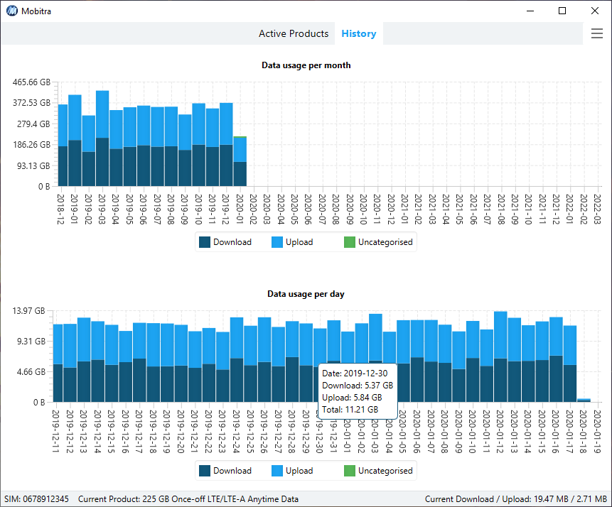

Mobitra - Telkom Mobile Prepaid LTE Data Usage Tracker
======================================================

Mobitra is a Windows desktop application that tracks Telkom Mobile prepaid LTE data usage
over Huawei LTE routers (e.g. B618, E5573, etc). It provides finer grained data usage
reports and charts compared to the official Telkom site and mobile app, where only the total
data usage and balances are reported. This gives you better insight into your prepaid LTE data
usage patterns.

## Features:

- Tracks Telkom Mobile prepaid LTE data usage.
- Runs in the background.
- Data usage reported per product (prepaid bundle), e.g. Anytime data usage vs. Night
  Surfer data usage.
- Shows the daily/monthly download and upload amounts.
- Cumulative line chart of the daily usage per product or for all active products.
- Bar chart of the daily usage per product or for all active products.
- Historic daily and monthly bar charts.

## Installation and Setup:

- [Download](https://github.com/mpaulse/mobitra/releases) the latest release. See the
  [changelog](CHANGELOG.md) for the release notes.
- Extract the release ZIP file into a directory of your choice.
- Execute mobitra.exe.
- On the Settings screen, specify the Huawei router IP address and any other
  relevant configuration.

## Screenshots:

Daily data usage for all active products:

Historic daily and monthly data usage:

## Development:

See the [development notes](doc/develop.md).
